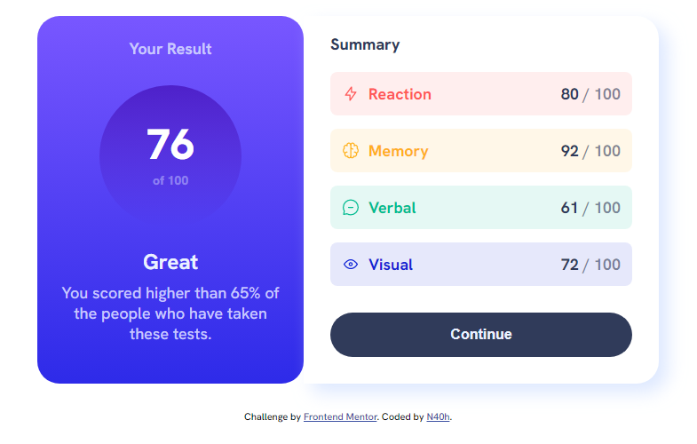

# Frontend Mentor - Results summary component

This is my solution to the [Results summary component challenge on Frontend Mentor](https://www.frontendmentor.io/challenges/results-summary-component-CE_K6s0maV).

## Table of contents

- [Overview](#overview)
  - [Challenge](#the-challenge)
  - [Screenshot](#screenshot)
  - [Links](#links)
- [My process](#my-process)
  - [What I learned](#what-i-learned)

## Overview

### Challenge

Users should be able to:

- View the optimal layout for the interface depending on their device's screen size
- See hover and focus states for all interactive elements on the page

### Screenshot



### Links

- Solution URL: [GitHub repository](https://github.com/N40h/results-summary-component)
- Live Site URL: [Add live site URL here](https://your-live-site-url.com)

## My process

- Semantic HTML5 markup
- CSS custom properties
- Flexbox
- Mobile-first workflow (switched half way to desktop first)

### What I learned

How to made a circle with CSS and a good use of gradient background

```css
.circle-result {
	height: 160px;
	width: 160px;
	background: linear-gradient(
		180deg,
		hsla(256, 72%, 46%, 1),
		hsla(241, 72%, 46%, 0)
	);
	border-radius: 50%;
	display: flex;
	align-items: center;
	margin-bottom: 15px;
}
```

I doesn't do much box-shadow it was nice to made one

```css
box-shadow: 10px 10px 20px 0px hsla(221, 100%, 89%, 0.6);
```
